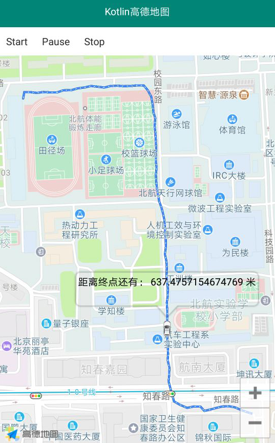

#Kotlin实现高德地图

   使用kotlin语言的方式实现高德地图，地图点选、点聚合、地图截图、地图文字标注、地图基本操作、地图Marker自定义，Marker自定义弹窗、轨迹平滑处理、Marker平滑移动、多类型路径规划、定位、导航等


## Demo图片展示

| ---------- | ------------- | ------------- |
|  |  |  |

|  |  |  |

|  |  |  |

|  |


## 类说明

| 描述 | 类 |
| ---------- | ------------- |
|地图基础功能|
|地图点选        |ChoosePointActivity|
|点聚合效果1     |ClusterMapActivity|
|点聚合效果2     |ClusterOverActivity|
|地图截图        |ScreenshotActivity|
|地图覆盖物|
|文字图标，3D楼块|CloverTaggingActivity|
|轨迹处理|
|轨迹管理        |MangerTrailActivity|
|平滑移动        |MoveMarkerActivity|
|轨迹平滑处理    |SmoothActivity|
|搜索|
|地图搜索        |SearchActivity|
|路线规划|
|多路径规划      |CalculateRouteActivity|
|驾车规划        |DriveActivity|
|出行规划        |RouteActivity|
|定位导航|
|单次/连续定位   |ContinueLocationActivity|
|一键导航        |NaviRouteActivity|
|出行演示        |TripHostActivity|

